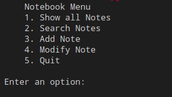
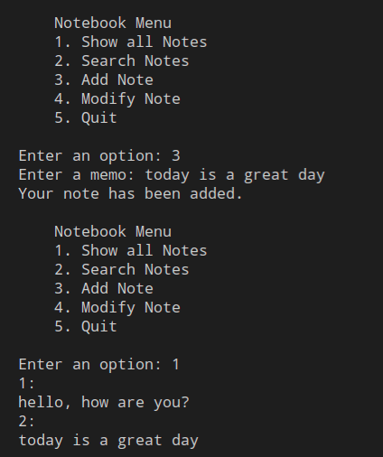
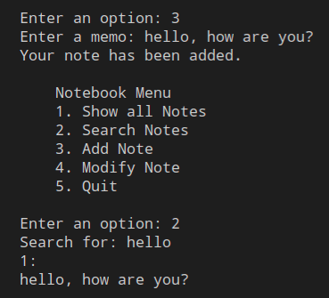
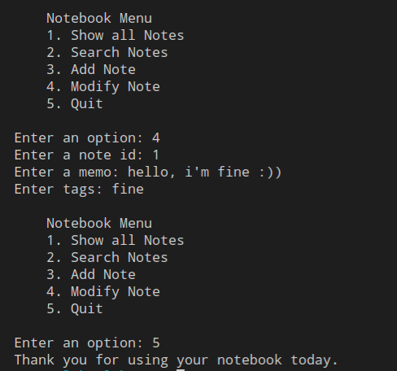

# A simple command-line notebook application

# Structure
Notes are short memos stored in a notebook. Each
note records the day it was written and can have tags added for easy querying.
It is possible to modify notes and search for them.
All of these things can be done from the command line.

# RUN
The program starts by the comand <python menu.py>, after what <Menu().run()> command is run.

Here are the proccess of the programm work:

These are the actions user can make from his/her command line with notebook.

That simple you can add a new note or search for the older one.

Also, you can replace the old note with the new one and finish the programm when t=you are done.
